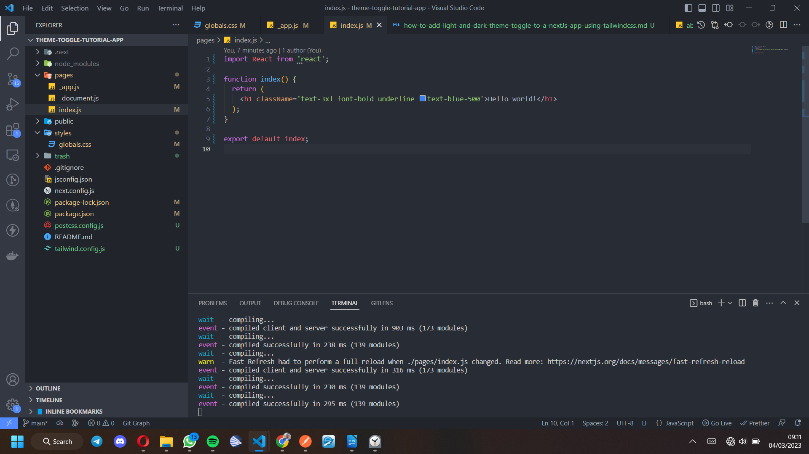
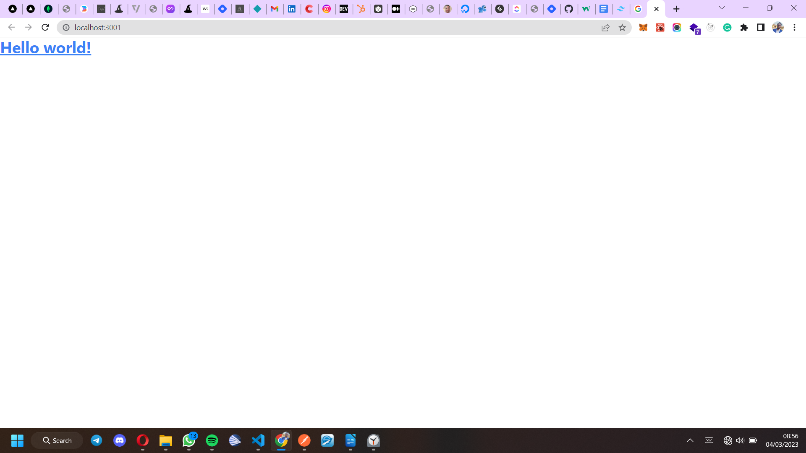
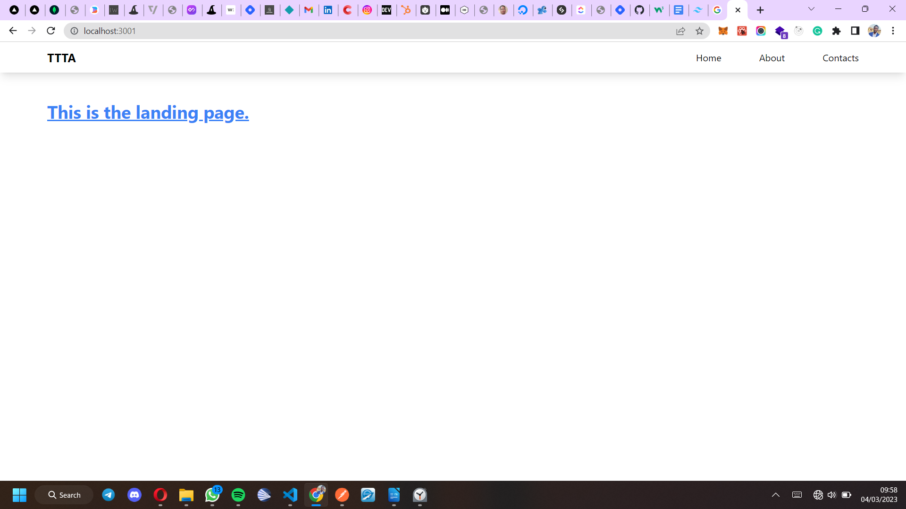
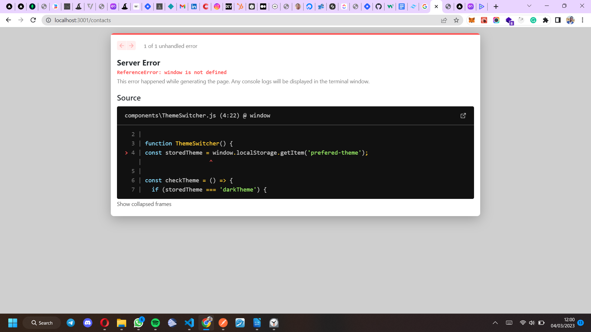
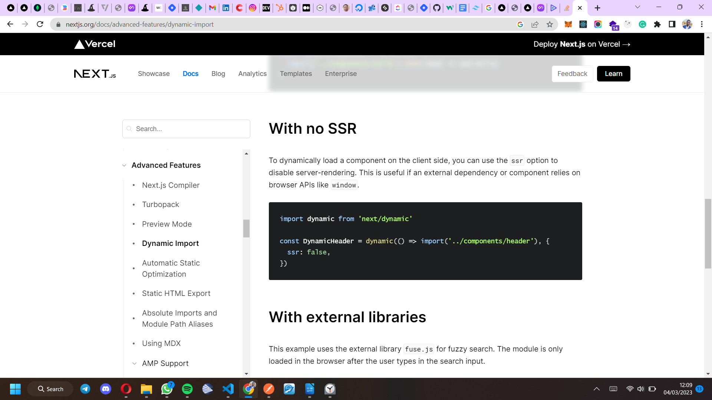
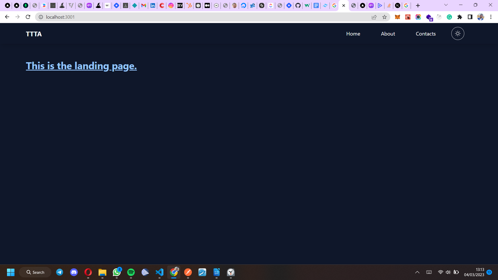
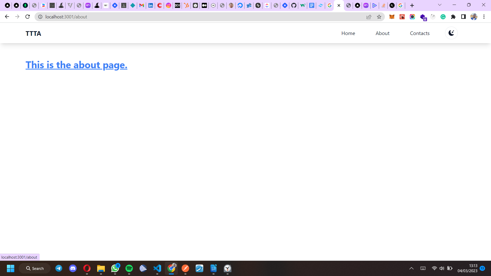

<div align="center">
This article is copyrighted. All rights right reserved by Andrew James Okpainmo [for smashing magazine](https://www.smashingmagazine.com) Please do not copy or infringe in any form.
</div>
<br> 
<div align="center">
  <h1>How To Add Light And Dark Theme Toggle To A NextJs App Using Tailwindcss</h1>
</div>
<br>

## Introduction

The world of programming is a “world of trends”. Trends come and go. While some last for just a little while, others can last very long – some might even get to stay forever.

Such trends can be in the form of preferences for certain programming languages, libraries/frameworks or the use of certain design/development patterns.

One trend that impresses me quite well, is the "theme-ing" trend. It’s very common nowadays to see applications or websites with the theme-toggle functionality – a feature that enables users to select themes or color preferences with which they wish to explore the app or website.

The most common theme functionality, is the light-dark mode selection.

## Is Color/Theme-Toggling Even A Necessity At All?

While some might argue that this feature Is not necessary for apps or websites, I beg to differ.
It’s fine if the scope and/or demands of the project does not require it.

Here are four reasons why adding the theme toggle functionality to your app will be a great choice.

1. The first reason is the health benefit. You don’t want to wake up in the morning and feel scared to look into your gadgets because you don’t want your eyes to burn as a result of their bright screens. The effect of bright screen lights that we come in contact with daily, can become a huge problem if we don’t minimize them. This is where being able to toggle into dark mode becomes really important.

2. My second reason for liking the theme-toggle functionality is the fact that this functionality just seem to add some “extra” touch of excellence to your app or website. Kind of some extra “quality” that appeals more to the user.

3. The third reason why I implement this feature a lot, is how easy it is to implement if only you get to understand the logic behind how to implement it.

4. My final argument on behalf of this trend, falls back to user experience. You just can’t underestimate the comfort and better experience that users get from being able to toggle between themes while on your app or website.

Now, that we know it’s an important feature, let’s learn how to implement this functionality in a NextJs app. We’ll be doing so with the awesome super-powers of tailwindcss.

> NextJs is a Javascript framework that is built on top of ReactJs. It’s more like ReactJs with extra “super-powers”. Tailwindcss on the other hand, is an amazing utility-first CSS framework that helps you build user interface with ease and speed. It’s a CSS framework that I’ve come to love so much.

## Understanding The Logic Behind Theme Toggling In A NextJs App

The combined forces of NextJs, tailwindcss, and this simple logic that I’ve been using, makes implementing the theme-toggle functionality very easy and developer friendly.

Here is a summary of how it works.

1. It starts with customizing your CSS color classes by selecting a color for light mode, then another color for dark mode. The usual design pattern, is to choose the same color, but make it lighter when dark mode it selected, and darker when light mode is selected.

2. Secondly, You’ll need to Understand the “dark” class-toggle logic. This logic simply requires you to set light mode to default during styling. Then trigger a “global” change of colors by applying a “dark” class to the root/parent element of you app or website.

## Setting Up The Tutorial Project

This logic will better be understood when we implement it. So let’s jump right in.

### Creating The Project.

The project will be very detailed. First, let’s create a NextJs app. We’ll name the app “theme-toggle-tutorial-app”. I’ll be adding a link to a Github repository for the project at the end to help you grasp the tutorial even further.

### Setting Up The NextJs App

The [tailwindcss framework guide for NextJs](https://tailwindcss.com/docs/guides/nextjs) has a very detailed step by process for setting up a NextJs project with tailwindcss. Do check it out to get more help.

First, we’ll run the following command to create a NextJs app.

```
npx create-next-app@latest theme-toggle-tutorial-app

```

Follow the resulting prompt to install the app. Feel free to make the selections as you wish if you’re confident enough that you’ll find you way through.

1. First type in “y” to continue.
2. Next, select “No” for typescript.
3. Similarly, select “No” for eslint.
4. Also select “No” for the “src/” directory. We’ll be using the page directory for this project.
5. Select “No” as well for the experimental “app/” directory.
6. Ignore the “import alias” prompt, and click enter.

Then wait for the app to install.

Now, let’s switch into our app directory.

```
cd theme-toggle-tutorial-app

```

Add the code below(if you’re using vscode), to open a new vscode window for our project.

```
code .

```

Next, create a trash folder and move all unwanted files into it. We’ll move the “api” folder and all the css files in the “styles” folder into it.

Next, let’s create our own css file – still name it “globals.css” and leave it empty for now.

### Adding Tailwindcss To The Project.

Run the following commands to add tailwindcss to the project.

```
npm install -D tailwindcss postcss autoprefixer

```

Next, run the “init” command to generate the tailwindcss config files.

```
npx tailwindcss init -p

```

### Configuring Tailwindcss.

Now, update the “tailwind.config.js” file to look like this;

```

/** @type {import('tailwindcss').Config} */
module.exports = {
  content: [
    './pages/**/*.{js,ts,jsx,tsx}',
    './components/**/*.{js,ts,jsx,tsx}',
    './app/**/*.{js,ts,jsx,tsx}',
  ],
  plugins: [],

  darkMode: 'class',

  theme: {
    extend: {},
  },
  plugins: [],
};


```

> The “Darkmode: class” part of the above code is super important – it’s actually what performs the toggle magic. After everything, try commenting that part of the code and see. The theme-toggling will stop working.

Now add tailwindcss directives to the “globals.css” file you created.

```

@tailwind base;
@tailwind components;
@tailwind utilities;

```

By now, your app structure should look more like the one below.



Next, delete all the content of the “index.js file” completely, and add this code snippet as seen on the screen into it. simply copy it from below.

```

import React from 'react';

function index() {
  return (
    <h1 className='text-3xl font-bold underline text-blue-500'>Hello world!</h1>
  );
}

export default index;


```

Next, start the app with the command below.

```

npm run dev

```

If your app successfully starts with a screen looking like the one below, then everything is fine, this means our NextJs and tailwindcss installations are in good shape. The underline style and the blue color of the text are all as a result of the tailwindcss styles that we added in the “index.js” file.



> Please note that you can switch your javascript files to jsx by using the “.jsx” file extension instead of the “.js” extension. I prefer using “.jsx”, but for this tutorial, let’s leave that out and use the “.js” option instead.

### Building The App Pages And Components

The NextJs file-based routing system, makes it very easy to create pages. Simply create a new file in the pages directory, and it automatically becomes a page, and whatever you name it becomes the route/link to that page.

The “index.js” file serves as the landing page.

Now let’s create two new pages aside the landing page – a demo about-page(about.js) and a demo contacts-page(contacts.js) – all inside the “pages” directory.

Navigating between pages, will help to confirm how effectively our theme-toggling is working.

Up next, let’s create a nice-looking navbar component where we’ll add navigation links, and the theme-toggle switch. To do that, we’ll create a “components” folder inside our project.

The NextJs page-based routing prohibits adding of components into the pages directory. Only page based files should stay in the pages folder.

Hence, All components including this navbar component as shown below, will stay inside of the components folder.

```
import React from 'react';
import Link from 'next/link';

function Navbar() {
  return (
    <nav className='navbar w-full px-20 py-3 shadow-lg'>
      <div className='flex items-center'>
        <section className='nav-left font-bold mr-auto text-xl'>TTTA</section>
        <ul className='nav-links flex gap-16 items-center'>
          <Link href='/'>
            <li>Home</li>
          </Link>
          <Link href='/about'>
            <li>About</li>
          </Link>
          <Link href='/contacts'>
            <li>Contacts</li>
          </Link>
        </ul>
      </div>
    </nav>
  );
}

export default Navbar;


```

Now, update the code in the “index.js” file to look like the one below.

```

import React from 'react';
import Navbar from '@/components/Navbar';

function Home() {
  return (
    <main className='min-h-screen text--colors_default bg--default'>
      <Navbar />
      <h1 className='text-3xl font-bold underline text--colors_primary px-20 py-12'>
        This is the landing page.
      </h1>
    </main>
  );
}

export default Home;


```

Also update the “about.js” and the “contacts.js” files to look like the ones below.

```

import React from 'react';
import Navbar from '@/components/Navbar';

function AboutPage() {
  return (
    <main className='min-h-screen'>
      <Navbar />
      <h1 className='text-3xl font-bold underline text-blue-500 px-20 py-12'>
        This is the about page.
      </h1>
    </main>
  );
}

export default AboutPage;


```

```
import React from 'react';
import Navbar from '@/components/Navbar';

function ContactsPage() {
  return (
    <main className='min-h-screen'>
      <Navbar />
      <h1 className='text-3xl font-bold underline text-blue-500 px-20 py-12'>
        This is the contacts page.
      </h1>
    </main>
  );
}

export default ContactsPage;


```

Now that we’ve imported our navbar into all our pages, let’s give the app a routing test by navigating across all the pages before we proceed.

Your app landing page, and the other pages should look as clean as the one shown below by now.



### Adding Our Color Options

Here comes the part where we’ll explore some awesome super powers of tailwindcss.

Now, update the “globals.css” file with the code below.

```

@tailwind base;
@tailwind components;
@tailwind utilities;

/*
=========================================================
colour configuration using native tailwind css colours
=========================================================
*/

/** customized texts **/

.text--colors_default {
  @apply text-slate-900 dark:text-white;
}

.text--colors_primary {
  @apply text-blue-500 dark:text-blue-300;
}

/** customized backgrounds **/
.bg--default {
  @apply bg-white dark:bg-slate-900;
}


```

In the above code, we used the tailwindcss color classes, to customize how we want out text to look while on dark mode, and while on light mode. We also customized the background colors.

Next, do the following:

1. replace the “text-blue-500” class in “index.js”, “about.js”, and “contacts.js” with the “text—colors_primary” class that we created in out “globals.css” file above.

> If you check in your app after doing so, you will not notice any difference, because we customized the “text—colors_primary” class to still be “text-blue-500” when on light mode.

2. Similarly, add both the “text—colors_default” and “bg—default” classes to the “main” HTML tag in “index.js”, “contacts.js”, and “about.js”.

### Building The Theme Toggle Logic/Function

Up till this point, we still have not created out theme-toggle switch. This will be one of the most important part of this tutorial.

Now, create a new component in the “components” folder, and name it “ThemeSwitcher.js”. Add the following code to it.

```

import React, { useState, useEffect } from 'react';

function ThemeSwitcher() {
  const storedTheme = window.localStorage.getItem('prefered-theme');

  const checkTheme = () => {
    if (storedTheme === 'darkTheme') {
      return false;
    }
    return true;
  };

  const [isLight, setIsLight] = useState(checkTheme);

  function setLightTheme() {
    setIsLight(true);
    window.localStorage.setItem('prefered-theme', 'lightTheme');
  }

  function setDarkTheme() {
    setIsLight(false);
    window.localStorage.setItem('prefered-theme', 'darkTheme');
  }

  useEffect(() => {
    const setTheme = () => {
      const root = window.document.documentElement;
      const operatingSystemThemeDark = window.matchMedia(
        '(prefers-color-scheme: dark)'
      );

      if (storedTheme === 'darkTheme' && operatingSystemThemeDark.matches) {
        root.classList.add('dark');
      }

      if (storedTheme === 'darkTheme') {
        root.classList.add('dark');
      }

      if (storedTheme === 'lightTheme') {
        root.classList.remove('dark');
      }
    };
    setTheme();

    console.log(`${storedTheme} selected`);
  }, [storedTheme]);

  return (
    <div className='theme-switcher items-center ml-12 hidden'>
      <button
        type='button'
        className={`dark-mode-switch cursor-pointer mr-6 w-[40px] h-[40px] p-[10px] rounded-[100%]
        border ${!isLight && 'hidden'}`}
        onClick={setDarkTheme}
      >
        <svg
          xmlns='http://www.w3.org/2000/svg'
          // width="20"
          // height="20"
          fill='currentColor'
          className='bi bi-moon-stars-fill w-[18px] h-[18px]'
          viewBox='0 0 16 16'
        >
          <path d='M6 .278a.768.768 0 0 1 .08.858 7.208 7.208 0 0 0-.878 3.46c0 4.021 3.278 7.277 7.318 7.277.527 0 1.04-.055 1.533-.16a.787.787 0 0 1 .81.316.733.733 0 0 1-.031.893A8.349 8.349 0 0 1 8.344 16C3.734 16 0 12.286 0 7.71 0 4.266 2.114 1.312 5.124.06A.752.752 0 0 1 6 .278z' />
          <path d='M10.794 3.148a.217.217 0 0 1 .412 0l.387 1.162c.173.518.579.924 1.097 1.097l1.162.387a.217.217 0 0 1 0 .412l-1.162.387a1.734 1.734 0 0 0-1.097 1.097l-.387 1.162a.217.217 0 0 1-.412 0l-.387-1.162A1.734 1.734 0 0 0 9.31 6.593l-1.162-.387a.217.217 0 0 1 0-.412l1.162-.387a1.734 1.734 0 0 0 1.097-1.097l.387-1.162zM13.863.099a.145.145 0 0 1 .274 0l.258.774c.115.346.386.617.732.732l.774.258a.145.145 0 0 1 0 .274l-.774.258a1.156 1.156 0 0 0-.732.732l-.258.774a.145.145 0 0 1-.274 0l-.258-.774a1.156 1.156 0 0 0-.732-.732l-.774-.258a.145.145 0 0 1 0-.274l.774-.258c.346-.115.617-.386.732-.732L13.863.1z' />
        </svg>
      </button>
      <button
        type='button'
        className={`light-mode-switch cursor-pointer mr-6 w-[40px] h-[40px] p-[10px] rounded-[100%]
        border ${isLight && 'hidden'}`}
        onClick={setLightTheme}
      >
        <svg
          xmlns='http://www.w3.org/2000/svg'
          // width="20"
          // height="20"
          fill='currentColor'
          className='bi bi-brightness-high w-[18px] h-[18px]'
          viewBox='0 0 16 16'
        >
          <path d='M8 11a3 3 0 1 1 0-6 3 3 0 0 1 0 6zm0 1a4 4 0 1 0 0-8 4 4 0 0 0 0 8zM8 0a.5.5 0 0 1 .5.5v2a.5.5 0 0 1-1 0v-2A.5.5 0 0 1 8 0zm0 13a.5.5 0 0 1 .5.5v2a.5.5 0 0 1-1 0v-2A.5.5 0 0 1 8 13zm8-5a.5.5 0 0 1-.5.5h-2a.5.5 0 0 1 0-1h2a.5.5 0 0 1 .5.5zM3 8a.5.5 0 0 1-.5.5h-2a.5.5 0 0 1 0-1h2A.5.5 0 0 1 3 8zm10.657-5.657a.5.5 0 0 1 0 .707l-1.414 1.415a.5.5 0 1 1-.707-.708l1.414-1.414a.5.5 0 0 1 .707 0zm-9.193 9.193a.5.5 0 0 1 0 .707L3.05 13.657a.5.5 0 0 1-.707-.707l1.414-1.414a.5.5 0 0 1 .707 0zm9.193 2.121a.5.5 0 0 1-.707 0l-1.414-1.414a.5.5 0 0 1 .707-.707l1.414 1.414a.5.5 0 0 1 0 .707zM4.464 4.465a.5.5 0 0 1-.707 0L2.343 3.05a.5.5 0 1 1 .707-.707l1.414 1.414a.5.5 0 0 1 0 .708z' />
        </svg>
      </button>
    </div>
  );
}

export default ThemeSwitcher;


```

From the code as above, two important things that the toggle logic/function does, are.

1. To toggle between light and dark mode.
2. To check for the selected theme, and to also have it stored on the user's browser using local storage. That way, even when the user goes off you site and returns, the color/theme preferences will still take effect.

Do take some more time to go through the function. You might even get to grasp it well and improve it for your self.

> Also, do feel free to use the code in any of your projects - with no copyright fears. You have my full permission.

### Resolving Issues With Accessing The Window Object In NextJs.

NextJs is a Javascript framework that does pre-rendering by default. This means NextJs generates the code for web-app pages before-hand on a server before it reaches the browser. As a result of this, trying to access the window object in NextJs will not work on loading the page, since the server will not recognize a window – like the browser would.

As a result of this, our NextJs app will throw an error - crying out about a window it doesn’t seem to understand or know about.

See the screenshot below.



Now, we have to find a way around it.

I was able to come up with a pretty good fix for this, thanks to “dynamic import” – an advanced feature that NextJs has.

You can [learn more about dynamic import on NextJs’ website](https://nextjs.org/docs/advanced-features/dynamic-import) if you wish, but the screenshot below provides a summary of how we can use “dynamic import”(dynamic) along with the “no ssr” option to fix this problem.



### Implementing the toggle functionality.

Now we can import “dynamic” from NextJs, and wrap it around our “ThemeSwitcher” component so that we can then use it inside of our navbar component.

Our navbar component(Navbar.js) will now get updated to be as shown below.

```

import React from 'react';
import Link from 'next/link';
import dynamic from 'next/dynamic';

const DynamicThemeSwitcher = dynamic(() => import('./ThemeSwitcher'), {
  ssr: false,
});

function Navbar() {
  return (
    <nav className='navbar w-full px-20 py-3 shadow-lg'>
      <div className='flex items-center'>
        <section className='nav-left font-bold mr-auto text-xl'>TTTP</section>
        <ul className='nav-links flex  gap-16 items-center'>
          <Link href='/'>
            <li>Home</li>
          </Link>
          <Link href='/about'>
            <li>About</li>
          </Link>
          <Link href='/contacts'>
            <li>Contacts</li>
          </Link>
        </ul>
        <DynamicThemeSwitcher />
      </div>
    </nav>
  );
}

export default Navbar;


```

Now, let’s give our theme-toggle functionality a test. Check the screenshots below, to see how beautiful our app look on both light and dark modes.





## A Summary On How To Add Extra Themes/Color Options To Support Light and Dark Mode

Having understood the logic behind the theme-toggle funtionality, I believe you can now build on this and go even more “extreme”.

You might even wish to go as far as adding extra theme options on top of dark/light theme selection. More like being able to choose dark or light theme with different colors combinations for buttons and other parts of the website or app.

It’s all up to you.

Simply follow the patterns stated out in this article, add more relevant color customizations, then improve the toggle logic to get your desired result - if need be.

## Conclusion

Like I mentioned earlier, I am a big fan of the theme-toggle trend. Since I figured out how to implement this feature, I’ve been implementing it in most of the projects I’ve worked on. Almost all my side projects have this feature.

I believe this article has equipped you with all you need to begin shipping more appealing and user friendly app and websites - thanks to theme-toggling. I trust you enjoyed the article.

Even though this tutorial is NextJs based, the logic can be easily applied to any other Javascript framework or library of choice using tailwindcss. Implementing it in ReactJs will be very similar.

Here is a link to [the github repository](https://github.com/Okpainmo/theme-toggle-tutorial-project) hosting the project.

Thanks a lot for reading. I am glad you followed up to this point.
Cheers!!!
